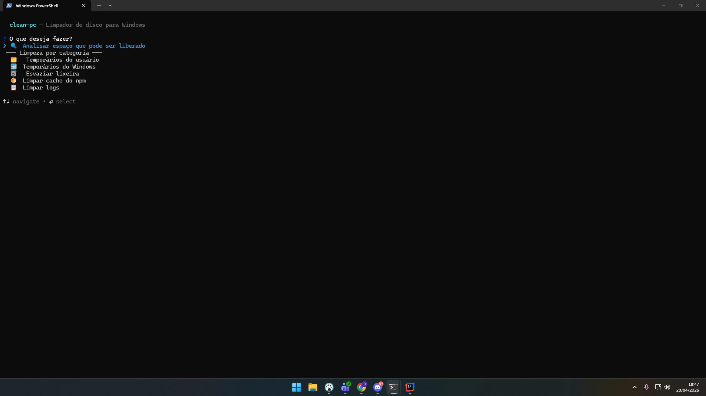
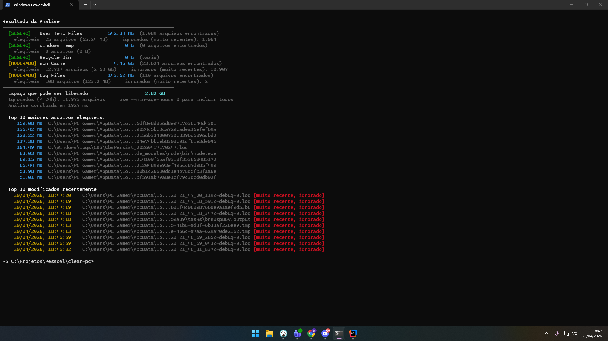
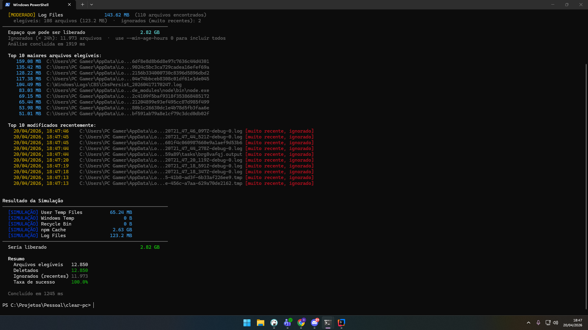

# clean-pc

Limpador de disco para Windows via terminal. Analisa arquivos temporários, cache e logs, e exibe exatamente o que vai ser deletado antes de apagar qualquer coisa.

<br>



---

## Funcionalidades

- **Menu interativo em pt-BR** — navegação por setas, sem precisar decorar comandos
- **Análise antes da limpeza** — sempre mostra o relatório completo antes de perguntar se pode limpar
- **Filtro de idade** — ignora arquivos modificados nas últimas 24h por padrão (configurável)
- **Top 10 maiores arquivos** — identifica o que realmente está ocupando espaço
- **Simulação (`--dry-run`)** — testa sem deletar nada
- **Proteção de paths críticos** — System32, Program Files e similares nunca são tocados
- **Detecção de symlinks** — TOCTOU guard em toda operação de exclusão
- **Executável standalone** — não precisa de Node.js instalado

---

## Instalação

### Download direto (recomendado)

Baixe o `clean-pc.exe` da [página de Releases](https://github.com/dariokrugerjunior/clear-pc/releases/latest) e coloque em qualquer pasta do seu PATH.

**Instalação rápida via PowerShell:**

```powershell
$url = "https://github.com/dariokrugerjunior/clear-pc/releases/latest/download/clean-pc.exe"
New-Item -ItemType Directory -Force "$env:USERPROFILE\bin" | Out-Null
Invoke-WebRequest -Uri $url -OutFile "$env:USERPROFILE\bin\clean-pc.exe"
```

> Adicione `%USERPROFILE%\bin` ao PATH do usuário se ainda não estiver:  
> Configurações → Sistema → Sobre → Configurações Avançadas do Sistema → Variáveis de Ambiente

### Build a partir do código-fonte

Requer Node.js 20+ e Windows SDK (para `signtool`).

```powershell
git clone https://github.com/dariokrugerjunior/clear-pc
cd clear-pc
npm install
npm run build:sea   # gera clean-pc.exe (~67 MB)
```

---

## Uso

### Menu interativo (padrão)

```
clean-pc
```



### Comandos diretos

```powershell
# Analisar todos os targets
clean-pc scan --targets userTemp,windowsTemp,recycleBin,npm,logs

# Simulação (sem deletar nada)
clean-pc clean --dry-run

# Limpeza real com confirmação
clean-pc clean --targets userTemp,npm
```



---

## Targets disponíveis

| Target | Caminho | Nível de risco |
|--------|---------|----------------|
| `userTemp` | `%LOCALAPPDATA%\Temp` | Seguro |
| `windowsTemp` | `C:\Windows\Temp` | Seguro |
| `recycleBin` | Lixeira do Windows | Seguro |
| `npm` | Cache do npm | Moderado |
| `logs` | Logs do sistema e WER | Moderado |

---

## Opções

| Flag | Descrição | Padrão |
|------|-----------|--------|
| `--targets <lista>` | Targets separados por vírgula | `userTemp` |
| `--dry-run` | Simula sem deletar | `false` |
| `--min-age-hours <n>` | Idade mínima do arquivo para ser elegível | `24` |

**Exemplos:**

```powershell
# Incluir todos os arquivos, ignorando o filtro de idade
clean-pc scan --targets userTemp --min-age-hours 0

# Limpeza completa em modo simulação
clean-pc clean --dry-run --targets userTemp,windowsTemp,recycleBin,npm,logs
```

---

## Segurança

- Paths protegidos por hardcode (nunca deletados): `System32`, `SysWOW64`, `WinSxS`, `Program Files`
- Cada arquivo passa por `lstat()` antes da exclusão para detectar substituição por symlink
- Validação de caminho base (TOCTOU) antes de qualquer operação de limpeza
- Arquivos recentes (< 24h) são ignorados por padrão
- Sempre pede confirmação antes de deletar (exceto em `--dry-run`)

---

## Desenvolvimento

```powershell
# Rodar sem build
npm run dev:scan
npm run dev:dry

# Type check
npm run typecheck

# Build ESM (para npm install -g)
npm run build

# Build executável standalone
npm run build:sea
```

### Fluxo de release

```powershell
git add .
git commit -m "feat: descrição"

npm version patch          # atualiza package.json e cria tag v1.x.x
git push && git push --tags  # dispara o GitHub Actions
```

O GitHub Actions compila o `clean-pc.exe` no Windows e publica automaticamente na página de Releases.

---

## Requisitos

- **Para usar o .exe:** Windows 10/11 (x64). Nenhuma dependência.
- **Para build:** Node.js 20+, Windows SDK (`signtool`).

> **Primeira execução:** o Windows SmartScreen pode exibir um aviso para executáveis sem assinatura de código. Clique em "Mais informações → Executar assim mesmo".
