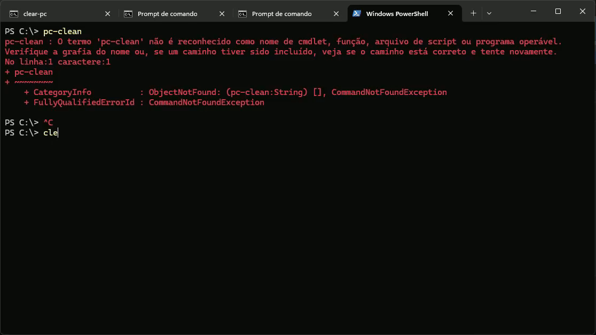

# clean-pc

[](https://github.com/dariokrugerjunior/clean-pc/actions/workflows/release.yml)
[](https://github.com/dariokrugerjunior/clean-pc/releases/latest)
[](LICENSE)


Limpador de disco para Windows via terminal. Analisa arquivos temporarios, cache e logs, e mostra exatamente o que vai ser removido antes de apagar qualquer coisa.

<br>



---

## Funcionalidades

- Menu interativo em pt-BR com banner ASCII compacto
- Analise antes da limpeza
- Filtro de idade para ignorar arquivos recentes por padrao
- Top 10 maiores arquivos
- Simulacao com `--dry-run`
- Protecao de paths criticos
- Deteccao de symlinks com guardas contra TOCTOU
- Executavel standalone, sem exigir Node.js instalado

---

## Instalacao

### Download direto

Baixe o executavel adequado na [pagina de Releases](https://github.com/dariokrugerjunior/clean-pc/releases/latest):

- `clean-pc-win-x64.exe`: recomendado para Windows 64-bit
- `clean-pc-win-x86.exe`: para Windows 32-bit

Exemplo de instalacao rapida da versao 64-bit via PowerShell:

```powershell
$url = "https://github.com/dariokrugerjunior/clean-pc/releases/latest/download/clean-pc-win-x64.exe"
New-Item -ItemType Directory -Force "$env:USERPROFILE\bin" | Out-Null
Invoke-WebRequest -Uri $url -OutFile "$env:USERPROFILE\bin\clean-pc.exe"
```

> Adicione `%USERPROFILE%\bin` ao PATH do usuario se ainda nao estiver configurado.

### Build a partir do codigo-fonte

Requer Windows e Node.js na versao exata definida em `.node-version`. `signtool` do Windows SDK e opcional.

```powershell
git clone https://github.com/dariokrugerjunior/clear-pc
cd clear-pc
npm ci

# gera clean-pc-win-x64.exe
npm run build:sea

# gera clean-pc-win-x86.exe
npm run build:sea:x86

# gera os dois executaveis com um unico bundle
npm run build:sea:all
```

---

## Como as arquiteturas sao tratadas

O bundle da aplicacao continua sendo unico: `npm run build:sea-bundle` roda uma vez e gera o JavaScript CommonJS usado por ambos os executaveis.

O empacotamento SEA roda separadamente por arquitetura:

- baixa o `node.exe` oficial da versao fixada em `.node-version`
- valida o SHA256 usando `SHASUMS256.txt` da distribuicao oficial do Node
- gera um blob SEA proprio para `x64` ou `x86`
- injeta esse blob no `node.exe` correspondente com `postject`

Isso e necessario porque o blob SEA precisa ser produzido pela mesma versao de Node que sera usada na injecao, e cada arquitetura usa seu proprio runtime do Node.

---

## Uso

### Menu interativo

```powershell
clean-pc
```

O modo interativo abre com um banner compacto, mostra a versao atual do executavel e organiza as acoes em um menu limpo e legivel para CMD e PowerShell.

Opcoes disponiveis:

- Analisar espaco que pode ser liberado
- Limpar temporarios do usuario
- Limpar temporarios do Windows
- Esvaziar lixeira
- Limpar cache do npm
- Limpar logs
- Limpar cache do Windows Update
- Limpar dumps de memoria (crash dumps)
- Limpar cache do Delivery Optimization
- Limpar cache de shaders da GPU
- Limpar cache de miniaturas (thumbnails)
- Limpar imagens e build cache do Docker
- Limpeza segura completa
- Sair

Se quiser abrir o menu sem o banner:

```powershell
clean-pc --no-banner
```

### Comandos diretos

```powershell
# analisar todos os targets
clean-pc scan --targets userTemp,windowsTemp,recycleBin,npm,logs,windowsUpdate,crashDumps,deliveryOptimization,shaderCache,thumbnailCache

# simulacao, sem deletar nada
clean-pc clean --dry-run

# limpeza real com confirmacao
clean-pc clean --targets userTemp,npm
```

---

## Targets disponiveis

| Target | Caminho | Nivel de risco |
|--------|---------|----------------|
| `userTemp` | `%LOCALAPPDATA%\Temp` | Seguro |
| `windowsTemp` | `C:\Windows\Temp` | Seguro |
| `recycleBin` | Lixeira do Windows | Seguro |
| `npm` | Cache do npm | Moderado |
| `logs` | Logs do sistema e WER | Moderado |
| `windowsUpdate` | `C:\Windows\SoftwareDistribution\Download` | Moderado |
| `crashDumps` | `%LOCALAPPDATA%\CrashDumps`, `C:\Windows\Minidump`, `C:\Windows\LiveKernelReports`, `C:\Windows\memory.dmp` | Seguro |
| `deliveryOptimization` | `C:\Windows\SoftwareDistribution\DeliveryOptimization` | Moderado |
| `shaderCache` | `%LOCALAPPDATA%\D3DSCache`, `NVIDIA\DXCache`, `NVIDIA\GLCache`, `AMD\DxCache` | Seguro |
| `thumbnailCache` | `%LOCALAPPDATA%\Microsoft\Windows\Explorer\thumbcache_*.db`, `iconcache_*.db` | Seguro |
| `docker` | `docker system prune -a` (imagens + build cache + containers parados, **sem volumes**) | Moderado |

---

## Opcoes

| Flag | Descricao | Padrao |
|------|-----------|--------|
| `--targets <lista>` | Targets separados por virgula | `userTemp` |
| `--dry-run` | Simula sem deletar | `false` |
| `--min-age-hours <n>` | Idade minima do arquivo para ser elegivel | `24` |
| `--no-banner` | Oculta o banner no modo interativo | `false` |

Exemplos:

```powershell
# incluir todos os arquivos, ignorando o filtro de idade
clean-pc scan --targets userTemp --min-age-hours 0

# limpeza completa em modo simulacao
clean-pc clean --dry-run --targets userTemp,windowsTemp,recycleBin,npm,logs,windowsUpdate,crashDumps,deliveryOptimization,shaderCache,thumbnailCache,docker
```

> `windowsUpdate`, `deliveryOptimization` e `crashDumps` (especialmente `C:\Windows\Minidump` e `memory.dmp`) exigem terminal como Administrador para liberar arquivos protegidos. Sem privilegios, os arquivos que puderem ser lidos ainda serao limpos e os demais aparecem em "Falhas".
>
> `thumbnailCache` pode falhar se o Explorer estiver com os `thumbcache_*.db` bloqueados. Feche janelas do Explorer ou aceite as falhas — os arquivos sao regerados automaticamente.
>
> `docker` chama a CLI oficial (`docker system df` no scan e `docker system prune -a` na limpeza). Se o Docker CLI nao estiver no PATH ou o daemon estiver parado, o target reporta o erro e e ignorado. Volumes nao sao tocados — o comando NAO usa `--volumes`. O arquivo VHDX em si nao encolhe automaticamente depois do prune; para recuperar o espaco em disco, rode `wsl --shutdown` + `diskpart` (`compact vdisk`) ou `Optimize-VHD` num PowerShell como Administrador.

---

## Seguranca

- Paths protegidos por hardcode: `System32`, `SysWOW64`, `WinSxS`, `Program Files`
- Cada arquivo passa por `lstat()` antes da exclusao para detectar substituicao por symlink
- Validacao de caminho base antes de qualquer operacao de limpeza
- Arquivos recentes com menos de 24h sao ignorados por padrao
- Sempre pede confirmacao antes de deletar, exceto em `--dry-run`

---

## Desenvolvimento

```powershell
# rodar sem build
npm run dev:scan
npm run dev:dry

# typecheck
npm run typecheck

# build ESM para npm install -g
npm run build

# build SEA
npm run build:sea
npm run build:sea:x86
npm run build:sea:all
```

### Testar os executaveis localmente

```powershell
npm run build:sea:all

.\clean-pc-win-x64.exe --version
.\clean-pc-win-x64.exe scan --targets userTemp --min-age-hours 24
.\clean-pc-win-x64.exe clean --dry-run --targets userTemp --min-age-hours 24

.\clean-pc-win-x86.exe --version
.\clean-pc-win-x86.exe scan --targets userTemp --min-age-hours 24
.\clean-pc-win-x86.exe clean --dry-run --targets userTemp --min-age-hours 24
```

### Fluxo de release

```powershell
git add .
git commit -m "feat: descricao"

npm version patch
git push
git push --tags
```

O GitHub Actions compila `clean-pc-win-x64.exe` e `clean-pc-win-x86.exe` no Windows e publica ambos na pagina de Releases.

---

## Requisitos

- Para usar os `.exe`: Windows 10/11
- Para build: Node.js na versao definida em `.node-version`
- Para remover assinatura antes do `postject`: Windows SDK com `signtool` disponivel

> Na primeira execucao, o Windows SmartScreen pode exibir um aviso para executaveis sem assinatura de codigo.
